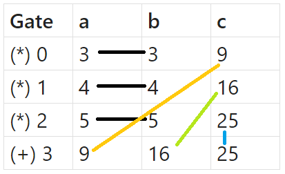
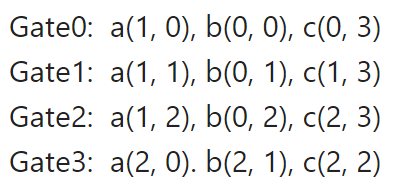

# PLONK implementation

## Overview

This is an implementation of PLONK. You all can use this one as a library.

## Details

This implementation closely follows the specifications outlined in the
[PLONK paper](https://eprint.iacr.org/2019/953.pdf). We have implemented all the relevant rounds
for both proof generation and verification. For detailed code, please
refer to the `prover.rs`and `verifier.rs` files located in the `src`
directory.

### What we use ?

We utilize the Bls12-381 curve for KZG commitment in this implementation. To learn more about this
curve, please refer to [this resource](https://github.com/sota-zk-lab/zkp-documents/blob/main/terms/bls12-381.md),
and for further insights into KZG commitment, you can explore
[our documentation](https://github.com/sota-zk-lab/zkp-documents/blob/main/terms/polynomial-commitment/100_kate_commitment.md).

All the dependencies utilized in this project are sourced from the `ark` (or `arkworks`) crates. For more information,
please visit [arkworks.rs](https://arkworks.rs/).

### Set up

Before proceeding, it's advisable to review the documentation on how to utilize this library:

- Clone this repository:
    ```
    git clone https://github.com/sota-zk-lab/zkp-implementation.git
    ```
- Enter to the `plonk` folder and run:
    ```
    cargo run --example plonk-example   
    ```

The above code will run the `main` function in `example.rs` files located in the `examples`
directory, which is the example usage of this library.

### Gates

> [!NOTE]  
> For now, we have not implemented a transformation function to convert plain equations
> into circuits automatically. So, we're adding gates manually. We will endeavor to create
> this function as soon as possible. If you're interested in contributing to this project
> in any capacity, feel free to raise the issue or create a pull request.

Let's take equation: `x^2 + y^2 = z^2` with `x = 3, y = 4, z = 5` as an example.
Prior to circuit generation, it's essential to parse it into smaller equations:

```
- x * x = m
- y * y = n
- z * z = q
- m + n = q
```

Consider each equation above as a gate. Here is the table of gates:



In the first equations, both the left and right parts of the left side are `x`, which means
they are the same. So, in the first gate, the values of `a` and `b` must be equal. It holds
true for the other gates as well. We denote this with colorful lines in the picture.

We store the value of each wire in gates in a 2-D vector, where the first dimension is either `0`, `1` or `2`,
corresponding to `a`, `b` or `c` respectively. Then, instead of storing each wire with its actual position
(e.g., wire `a` in gate `0` is `(0, 0)`, wire `c` in gate `3` is `(2, 3)`), we store it with its copied position.

In the example above, wire `a` in gate `0` is a copy of wire `b` in gate `0`, so we store `(1, 0)` for wire `a`
and `(0, 0)` for wire `b`. Similarly, wire `c` in gate `0` is a copy of wire `a` in gate `3`, so we store `(0, 3)`
for wire `c` and `(2,0)` for wire `a`. The following picture shows the full positions:



Now, you can create any circuit on your own and run PLONK on it.

> [!TIP]  
> If you are not familiar with the workings of PLONK, I recommend reading our slide
> [here](https://github.com/sota-zk-lab/zkp-documents/blob/main/presentations/plonk_implementation.pptx)

### Run

This library comes with some unit and integration tests. Run these tests with this command:

```
cargo test
```

You can view each round in generating proof step and verifying step does by:

```
cargo test  -- --nocapture
```

## References

[Permutations over Lagrange-bases for Oecumenical Noninteractive arguments of Knowledge](https://eprint.iacr.org/2019/953.pdf)<br/>
Ariel Gabizon, Zachary J. Williamson, Oana Ciobotaru

[Under the hood of zkSNARKs — PLONK protocol: part 1-6](https://medium.com/@cryptofairy/under-the-hood-of-zksnarks-plonk-protocol-part-6-5a030d15be68) <br/>
Crypto Fairy

[Understanding PLONK](https://vitalik.eth.limo/general/2019/09/22/plonk.html)<br/>
Vitalik Buterin


