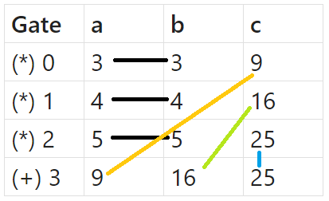

# PLONK implementation

## Overview
This is an implementation of PLONK. You all can use this one as a library.


## Details

This implementation is closed to what is written on the [PLONK paper](https://eprint.iacr.org/2019/953.pdf).
We have implemented all the corresponding rounds for generating proof step and verifying step. You can read the code
in 2 files: [prover.rs](src/prover.rs) and [verifier.rs](src/verifier.rs) for further details. 

### What we use ?
Here, we use curve: Bls12-381 for KZG commitment. You can discover more about this curve [here](https://github.com/sota-zk-lab/zkp-documents/blob/main/terms/bls12-381.md),
and KZG commitment [here](https://github.com/sota-zk-lab/zkp-documents/blob/main/terms/polynomial-commitment/100_kate_commitment.md)

All the dependencies we used here are from `ark` a.k.a `arkworks` crates. You can read about it [here](https://arkworks.rs/).

### Set up

First, you should check how you can use this library:

- Clone this repository:
    ```
    git clone https://github.com/sota-zk-lab/zkp-implementation.git
    ```
- Enter to the `plonk` folder and run:
    ```
    cargo run --example plonk-example   
    ```
The above code will run the `main` function in [example.rs](examples/example.rs), which is the example usage of this library.

Now, you will get a little bit confuse about how we design out circuit. Let us describe below.

> [!NOTE]  
> For now, we have not implemented a transform function from plain equations into circuits. So we have
> to add gates manually. We will endeavor to create this function as soon as possible. If you want to contribute
> to this project in any way, feel free to raise the issue or create a pull request.

Let's take equation: `x^2 + y^2 = z^2` with `x = 3, y = 4, z = 5` as example.
Before generating circuit, we should parse it into some smaller equation:
```
- x * x = m
- y * y = n
- z * z = q
- m + n = z
```

Consider each equation above as a gate. Here is the table of gates:



You can see that in the first line, both the left part and right part of the left side are `x`, which means
they are equal. So, in the first gate, the values of `a` and `b` must be equal. It holds true for the other gates
as well. We denote this with colorful lines in the picture.

We also store value of each wire in gates into a 2-D vector, where the first dimension is either `0`, `1` or `2`,
corresponding to `a`, `b` or `c`. Then, instead of store each wire with its actual position (like wire `a` in 
gate `0` is `(0, 0)`, wire `c` in gate `3` is `(2, 3)`...), we store it with its copied position.

For the example above, wire `a` in gate `0` is a copy of wire `b` in gate `0`, so we store `(1, 0)` for wire `a` 
and `(0, 0)` for wire `b`. Similarly, wire `c` in gate `0` is a copy of wire `a` in gate `3`, so we store `(0, 3)` 
for wire `c` and `(2,0)` for wire `a`. The picture below shows the full positions:


So now, you can create any circuit on your own and run PLONK on it.

> [!TIP]  
> If you do not fully understand how PLONK works, I recommended that you should read our presentation 
> [here](https://github.com/sota-zk-lab/zkp-documents/blob/main/presentations/plonk_implementation.pptx)

### Run
This library comes with some unit and integration tests. Run these tests with:
```
cargo test
```

You also can view each round in generating proof step and verifying step does by:
```
cargo test  -- --nocapture
```

## References
[Permutations over Lagrange-bases for Oecumenical Noninteractive arguments of Knowledge](https://eprint.iacr.org/2019/953.pdf)<br/>
Ariel Gabizon, Zachary J. Williamson, Oana Ciobotaru

[Under the hood of zkSNARKs — PLONK protocol: part 1-6](https://medium.com/@cryptofairy/under-the-hood-of-zksnarks-plonk-protocol-part-6-5a030d15be68) <br/>
Crypto Fairy

[Understanding PLONK](https://vitalik.eth.limo/general/2019/09/22/plonk.html)<br/>
Vitalik Buterin


